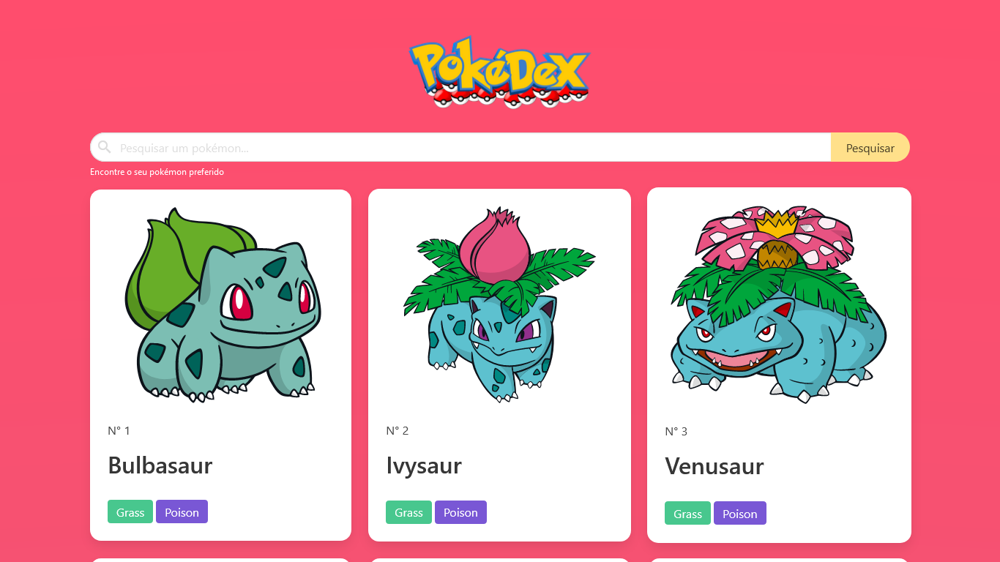
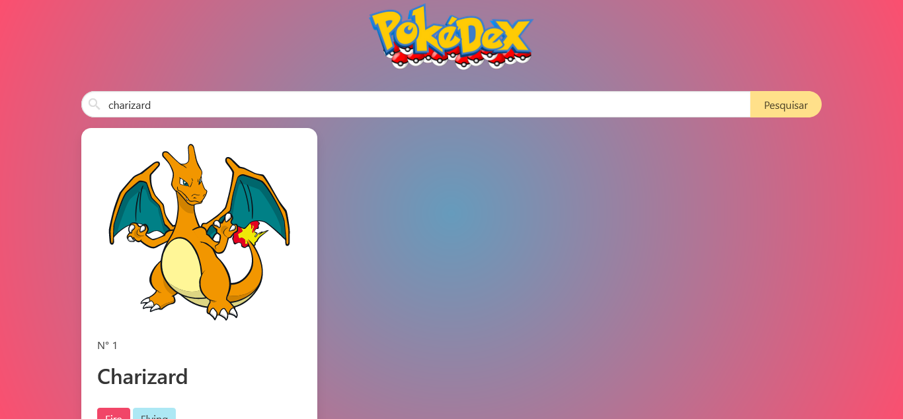

# Pokédex

- Pokédex desenvolvida com Vue.js, Bulma e Buefy e consumindo a API do PokéAPI utilizando o Axios.

### :computer: Demonstração

- Home



- Pesquisa de pokémons



## :hammer: Configuração do projeto

### :heavy_check_mark: Pré-requisitos:
    - Git
    - Node.js
    - NPM ou Yarn
    - Editor de código (VSCode, Sublime, Atom, etc...)

## :rocket: Rodando a aplicação no seu computador

### :one: Clone o repositório

```
git clone https://github.com/Lucas98Fernando/pokedex.git
```
### :two: Instale as dependências

```
npm install
```

### :three: Compilação e hot-reload para desenvolvimento
```
npm run serve
```

### :four: Compilar e minificar para produção
```
npm run build
```

### :five: Lints e corrigir arquivos
```
npm run lint
```

### Customizar configuração
Ver [Referência de Configuração](https://cli.vuejs.org/config/).